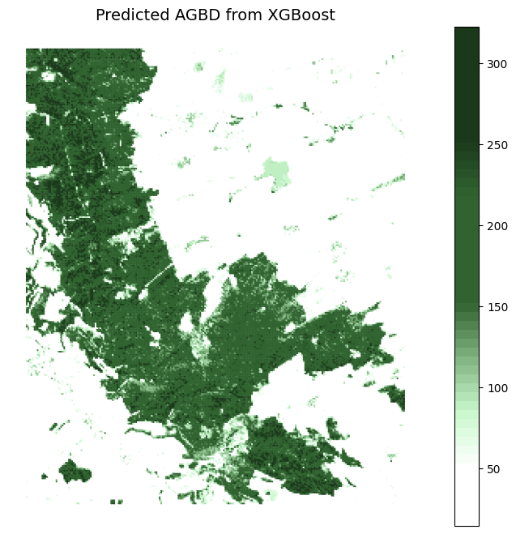

# Forest Biomass Estimation from GEDI & Sentinel Data

**Description:** A set of Jupyter notebooks for estimating Aboveground Biomass Density (AGBD) using GEDI LiDAR and Sentinel satellite data.

---

## 📖 Overview

This repository contains **three Jupyter notebooks** that together perform a complete workflow to estimate aboveground biomass density (AGBD) for a chosen Area of Interest (AOI).  
The workflow uses **NASA GEDI LiDAR data** for biomass ground truth and **Sentinel-1/2 data** for predictor variables.  

The process includes:

1. **Data Collection** – Retrieving GEDI and Sentinel imagery from Google Earth Engine  
2. **Data Preprocessing** – Cleaning, resampling, masking, and preparing training data  
3. **Regression Modelling** – Training a machine learning model (XGBoost) to predict AGBD

---

## 📂 Repository structure

    ├── data_collection.ipynb     # Downloads GEDI + Sentinel datasets
    ├── data_preprocessing.ipynb  # Processes, masks, and merges datasets
    ├── regression.ipynb          # Trains ML model & predicts AGBD
    ├── data/                  # Optional: exported maps, CSVs, models
    └── README.md                 # This file

    ## 🔄 Workflow

1. **Data Collection** (`data_collection.ipynb`)  
   - Download GEDI, Sentinel-1, and Sentinel-2 data from Google Earth Engine.  
   - Clip data to the Area of Interest (AOI).  
   - Export raw datasets for preprocessing.

2. **Data Preprocessing** (`data_preprocessing.ipynb`)  
   - Resample and align datasets to a common resolution (e.g., 100 m).  
   - Mask invalid or unsuitable pixels (e.g., based on land-use codes).  
   - Merge predictor variables into a single stack.  
   - Split data into training and prediction datasets.

3. **Regression & Prediction** (`regression.ipynb`)  
   - Train an XGBoost regression model using available GEDI biomass observations.  
   - Predict Aboveground Biomass Density (AGBD) for all valid pixels.  
   - Calculate total AGB over the AOI.  
   - Generate maps and visualizations.

